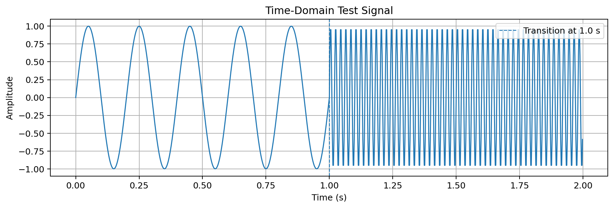
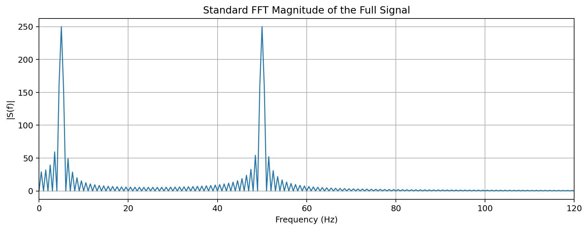
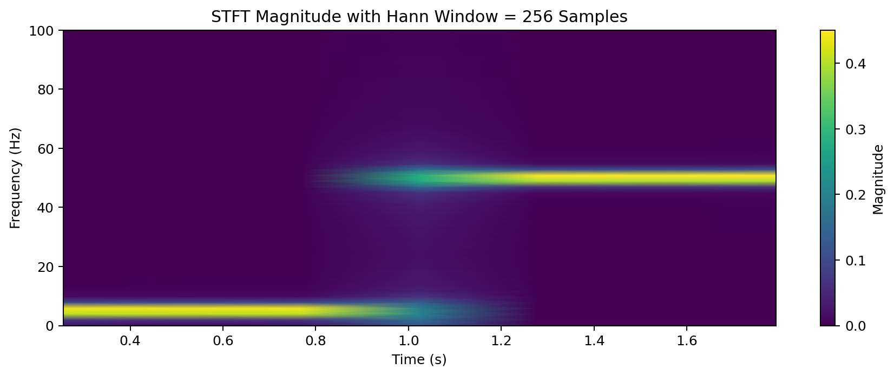
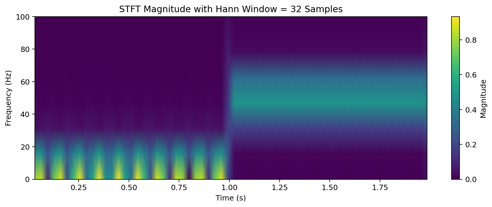
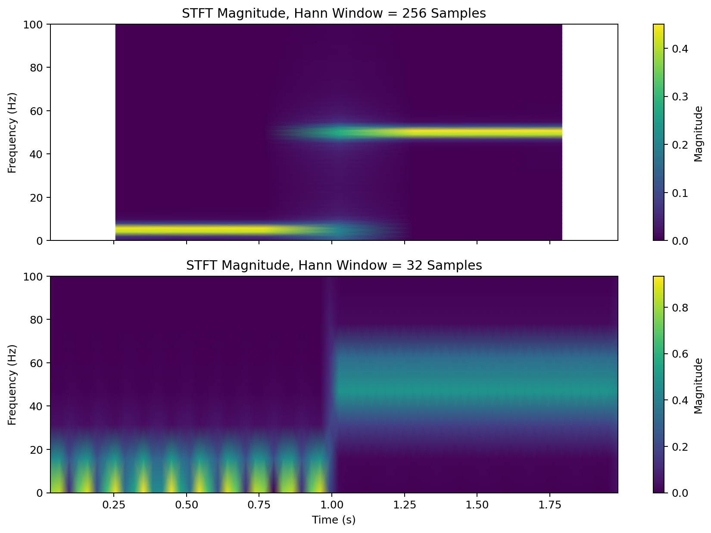
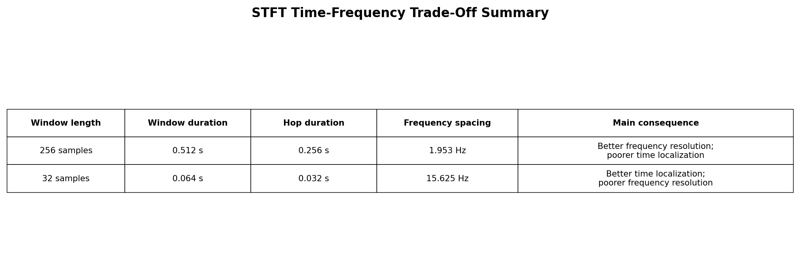

# NTUU KPI — Fundamentals of Harmonic Analysis — Practical 12

## Course

**Fundamentals of Harmonic Analysis**  
**Mathematical Support for Multimedia and Information Retrieval Systems**

## Practical Work

**Practical 12: The Short-Time Fourier Transform (STFT) and Spectrograms**

## Student Information

**Student:** Xiaodi Wang  
**Group:** KP-44i  
**Program:** BSc in Software Engineering  
**University:** NTUU KPI  

---

## Objective

The objective of this practical work is to visualize the time-frequency trade-off using the Short-Time Fourier Transform and spectrograms.

This practical demonstrates why the standard FFT is not enough for non-stationary signals and how the STFT provides a time-frequency representation.

---

## Key Outcome

This practical work gives a concrete understanding of the fixed-resolution limitation of the STFT.

A long window gives better frequency resolution but weaker time localization.  
A short window gives better time localization but weaker frequency resolution.

---

## Project Structure

```text
Practical12_Xiaodi_Wang_KP-44i_submit_ready.docx
common_stft_utils.py
task1_generate_test_signal.py
task2_standard_fft.py
task3_compute_stft.py
task4_time_frequency_tradeoff_analysis.py
requirements.txt
VSCode_macOS_run_examples.md
outputs/
```

---

## Task 1 — Generate Test Signal

In this task, a synthetic non-stationary signal is generated.

The first half of the signal contains a low-frequency sinusoid of 5 Hz.  
The second half contains a high-frequency sinusoid of 50 Hz.

This signal is useful because its frequency content changes over time.

### Output



### Observation

The first half of the signal has slow oscillations, while the second half has rapid oscillations. This confirms that the signal contains different frequency behavior in different time intervals.

---

## Task 2 — Standard FFT

The standard FFT is applied to the full signal.

The FFT shows that the signal contains both 5 Hz and 50 Hz frequency components. However, it cannot show when each frequency appears.

### Output



### Observation

The FFT magnitude spectrum shows the main frequency components of the signal. However, time information is lost because the FFT analyzes the entire signal globally.

Therefore, the standard FFT is useful for stationary signals, but it is limited when the signal changes over time.

---

## Task 3 — Short-Time Fourier Transform

The STFT divides the signal into short overlapping windows and applies the Fourier Transform to each window.

In this practical work, two Hann window lengths are compared:

- 256 samples
- 32 samples

The purpose is to observe how window size affects time and frequency resolution.

---

### STFT with Long Window: 256 Samples



### Observation

The long window provides better frequency resolution. The 5 Hz and 50 Hz components are more clearly separated in frequency.

However, the transition between the low-frequency part and the high-frequency part is less sharp in time. This means the high-frequency burst is more smeared along the time axis.

---

### STFT with Short Window: 32 Samples



### Observation

The short window provides better time localization. The change from the 5 Hz part to the 50 Hz part is easier to locate in time.

However, the frequency bands become wider and less precise. This means the frequency resolution is worse.

---

### STFT Comparison



### Observation

The comparison shows the main trade-off of the STFT.

A long window gives better frequency accuracy but poorer time accuracy.  
A short window gives better time accuracy but poorer frequency accuracy.

This is the fixed-resolution limitation of the STFT.

---

## Task 4 — Time-Frequency Trade-Off Analysis

This task summarizes the time-frequency trade-off.

The STFT uses a fixed window length. Because of this, it cannot achieve high time resolution and high frequency resolution at the same time.

### Output



### Observation

The time-frequency trade-off follows the signal-processing form of the uncertainty principle:

```text
Delta t * Delta f >= 1
```

A longer window increases frequency accuracy but reduces time accuracy.  
A shorter window increases time accuracy but reduces frequency accuracy.

This is why the choice of window length is critical in STFT analysis.

---

## How to Run on macOS with VS Code

Open the project folder in VS Code.

Then open the integrated terminal and run:

```bash
python3 -m venv .venv
source .venv/bin/activate
```

Install dependencies:

```bash
python3 -m pip install --upgrade pip
python3 -m pip install -r requirements.txt
```

Run all tasks:

```bash
python3 task1_generate_test_signal.py
python3 task2_standard_fft.py
python3 task3_compute_stft.py
python3 task4_time_frequency_tradeoff_analysis.py
```

Generated figures will be saved in the `outputs` folder.

---

## Main Python Files

### `common_stft_utils.py`

This file contains shared helper functions for generating the test signal, creating the output folder, and saving figures.

### `task1_generate_test_signal.py`

This file generates the test signal and plots it in the time domain.

### `task2_standard_fft.py`

This file computes the standard FFT of the full signal and plots the frequency spectrum.

### `task3_compute_stft.py`

This file computes the STFT using different window lengths and compares the resulting spectrograms.

### `task4_time_frequency_tradeoff_analysis.py`

This file creates a summary figure explaining the STFT time-frequency trade-off.

---

## Technical Explanation

The standard Fourier Transform represents a signal in the frequency domain. It is effective when the signal is stationary, meaning its frequency content does not change significantly over time.

However, many real signals are non-stationary. Examples include speech, music, biomedical signals, seismic signals, and transient events. For these signals, knowing only the frequency components is not enough. It is also necessary to know when each frequency component appears.

The STFT solves this problem by applying the Fourier Transform to short sections of the signal. Each section is multiplied by a window function, such as a Hann window. The result is a time-frequency representation called a spectrogram.

The limitation is that the STFT uses a fixed window size. This creates a fixed time-frequency resolution. A larger window contains more samples and therefore gives more accurate frequency information. However, it also covers a longer time interval, so sudden changes are less precisely located. A smaller window captures rapid time changes better, but it contains fewer samples, so frequency estimation becomes less accurate.

---

## Conclusion

The standard FFT is useful for identifying the global frequency components of a signal, but it cannot show when each frequency occurs.

The STFT solves this problem by dividing the signal into short overlapping windows and applying FFT to each window. This creates a time-frequency representation.

However, the STFT has a fixed-resolution limitation. A long window improves frequency resolution but weakens time localization. A short window improves time localization but reduces frequency precision.

Therefore, the choice of window length is important in practical signal analysis, especially for non-stationary signals such as speech, music, biomedical signals, and transient events.

---

## Repository Content

This repository contains the source code, generated figures, and final report for Practical 12 of the course **Fundamentals of Harmonic Analysis: Mathematical Support for Multimedia and Information Retrieval Systems**.
